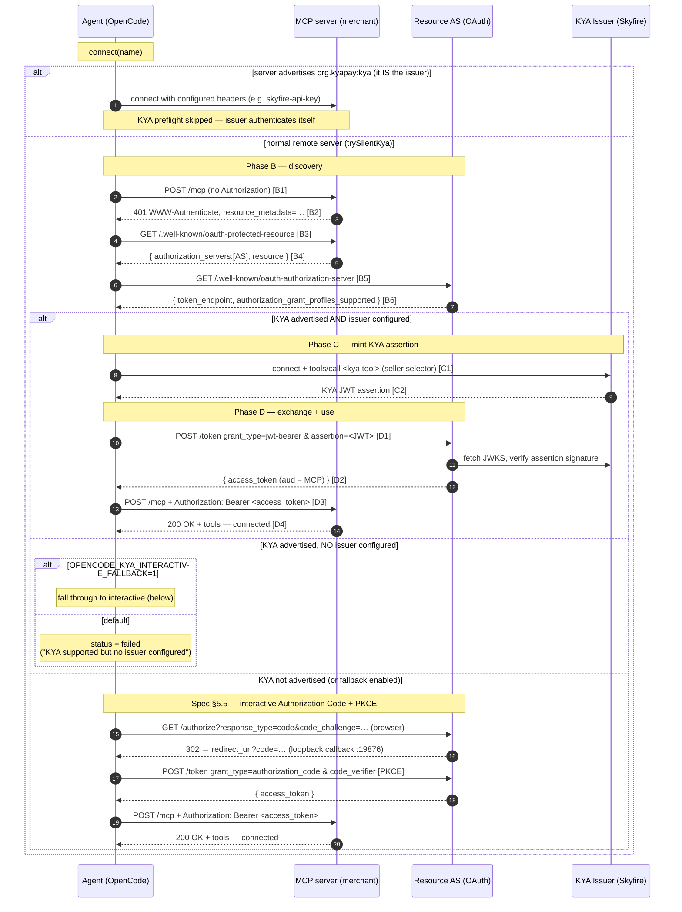

# Mock MCP + KYA OAuth (Skyfire issuer + local mock OAuth + local mock MCP)

This doc describes how OpenCode authenticates to a **mock MCP server** using a **KYA-style flow** where:

- **Skyfire MCP** is used as the **token issuer** (via MCP tool call).
- A **local mock MCP server** requires an access token.

OpenCode does **not** call Skyfire's REST APIs directly.

It also includes instructions to run the full flow locally.

---

## Overview

### Services

| Service                  | Purpose                                           | Default URL                  |
| ------------------------ | ------------------------------------------------- | ---------------------------- |
| OpenCode instance server | UI/API that manages MCP connections               | `http://localhost:4096`      |
| Mock MCP server          | Protected MCP resource (requires Bearer token)    | `http://127.0.0.1:8787`      |
| Mock OAuth server        | OAuth AS (discovery/registration/token endpoints) | `http://127.0.0.1:8788`      |
| Skyfire MCP issuer       | Mints a KYA JWT assertion via configured KYA tool | `http://mcp.skyfire.xyz/mcp` |

---

## What happens when you connect

When you connect an MCP server named `merchant-mcp`, OpenCode does (simplified):

1. **Unauthenticated probe (spec B1–B2)**
   - `POST http://127.0.0.1:8787/mcp` with no `Authorization` header.
   - Mock MCP responds `401` with a `WWW-Authenticate` challenge that may carry a
     `resource_metadata="…"` pointer (RFC 9728).

2. **Authorization server discovery (B3–B5)**
   - OpenCode follows the `resource_metadata` pointer when present, otherwise
     falls back to the default RFC 9728 location:
   - `GET http://127.0.0.1:8787/.well-known/oauth-protected-resource`
   - Response points to the mock OAuth server on `8788`. OpenCode then reads the
     AS metadata (RFC 8414, with OpenID configuration as a fallback) and checks
     that `authorization_grant_profiles_supported` advertises the KYA profile
     (`urn:ietf:params:oauth:grant-profile:kya`). If it doesn't, KYA is skipped.

3. **Dynamic client registration (if needed)**

- (Removed) This demo flow does not require Dynamic Client Registration.

4. **KYA assertion minted by Skyfire MCP issuer**

- OpenCode connects to the configured **KYA issuer** — the remote MCP server
  whose `capabilities` map includes `org.kyapay:kya` (the server's name is irrelevant;
  the example below uses `skyfire`) — and calls the configured tool, e.g.
  `tools/call { name: "create-kya-token", arguments: <seller-selector> }`.
- The seller selector is one of:
  - `{ sellerServiceId: "<UUID>" }` — used when `OPENCODE_KYA_SELLER_SERVICE_ID` is exported.
  - `{ sellerDomainOrUrl: "<host>" }` — used otherwise, derived from the target MCP server URL.
    For a localhost target the host is substituted with `mcp-server.com`.
- Skyfire returns a **KYA JWT assertion** (not an OAuth access token).

5. **Exchange assertion for an OAuth access token (JWT-bearer)**

- OpenCode POSTs to the mock OAuth token endpoint (`http://127.0.0.1:8788/token`) with:
  - `grant_type=urn:ietf:params:oauth:grant-type:jwt-bearer`
  - `assertion=<kya_jwt>`
- Mock OAuth returns `{ access_token, token_type, ... }`.

6. **Retry MCP with Bearer access token**
   - OpenCode retries:
   - `POST http://127.0.0.1:8787/mcp`
   - with `Authorization: Bearer <access_token>`

- On success, OpenCode marks `merchant-mcp` as **connected** and loads tool definitions.

### Key point: no browser redirect

For KYA, the flow is **non-interactive** (no user browser step). If something opens an `/authorize` URL, it usually means KYA detection or the jwt-bearer exchange failed.

By default, if the server advertises KYA but no issuer is configured (or minting
fails), OpenCode surfaces a clear failure rather than falling back to interactive
OAuth. Set `OPENCODE_KYA_INTERACTIVE_FALLBACK=1` to instead fall through to the
standard interactive Authorization Code + PKCE flow when KYA can't complete.

---

## Sequence diagram


The full connect flow, including the issuer-skip, the advertisement gate, and the
interactive fallback. Step IDs (B/C/D) map to the spec phases.



Notes:

- The `connect` method runs the silent-KYA preflight up front; the auto-connect
  path runs it from the 401 catch handler. Either way the B→C→D steps are the same.
- The AS sets the access token's `aud` to the MCP server's canonical resource URI;
  the MCP server validates it as a plain OAuth 2.1 resource server (no KYA awareness).
- The interactive fallback's redirect lands on a loopback callback on the **server**
  host, so it only completes when the browser and instance server share a machine
  (unless a custom `oauth.redirectUri` is configured).

---

## Running locally

### 1) Install dependencies

From the repo root:

```bash
bun install
```

---

### 2) Start the mock MCP + mock OAuth servers

From the repo root:

```bash
bun run packages/opencode/script/mock-mcp-kya-server.ts
```

Expected:

- Mock MCP: `127.0.0.1:8787`
- Mock OAuth: `127.0.0.1:8788`

---

### One-command local demo

From the repo root, this starts both the mock MCP/OAuth server and the
OpenCode instance server:

```bash
bun run demo:kya
```

This does not edit or validate `.opencode/opencode.jsonc`; keep your Skyfire
MCP issuer configuration and API key there.

---

### 3) Configure OpenCode to use the mock MCP server

In the directory you’re running OpenCode against, add/update:

`.opencode/opencode.jsonc`

Example:

```jsonc
{
  "mcp": {
    "merchant-mcp": {
      "type": "remote",
      "url": "http://127.0.0.1:8787/mcp",
    },

    "skyfire": {
      "type": "remote",
      "url": "http://mcp.skyfire.xyz/mcp",
      "capabilities": {
        "org.kyapay:kya": {
          "tool": "create-kya-token",
        },
      },
      "headers": {
        "skyfire-api-key": "<your-skyfire-api-key>",
      },
    },
  },
}
```

Notes:

- OpenCode will prefer StreamableHTTP; SSE 404 is treated as unsupported.
- Set your Skyfire API key via the issuer MCP server's `headers.skyfire-api-key`.
- The KYA issuer is selected by **capability**, not by name: OpenCode uses the
  first remote MCP server whose `capabilities` map contains `org.kyapay:kya`.
  The nested `tool` value tells OpenCode which issuer MCP tool creates the KYA token.
  Omitting that entry means no issuer is found and KYA minting is skipped.

### 4) Seller target selection

The Skyfire `create-kya-token` MCP tool needs exactly one seller selector
(see [Skyfire create-token docs](https://docs.skyfire.xyz/reference/create-token)).
OpenCode supports both, with the following precedence:

1. **`sellerServiceId`** — explicit override via environment variable. If set,
   OpenCode passes it directly to the tool:

   ```bash
   export OPENCODE_KYA_SELLER_SERVICE_ID="662a28ea-fbd7-4bd3-9f05-3d3e6ea14d03"
   ```

2. **`sellerDomainOrUrl`** — derived from the **target MCP server's URL** when
   the env var above is unset:
   - For a public MCP server like `https://mcp.example.com/mcp`, the seller is
     `mcp.example.com`.
   - For a localhost/loopback target (e.g. the mock at
     `http://127.0.0.1:8787/mcp`), the hostname can't be resolved by the
     Skyfire seller directory, so OpenCode substitutes a stable placeholder:
     **`mcp-server.com`**.

No environment variable is required by default; export
`OPENCODE_KYA_SELLER_SERVICE_ID` only when you want to bind to a specific
Skyfire seller service.

Security note: do **not** commit API keys into the repo.

---

### 5) Start OpenCode instance server

From `packages/opencode`:

```bash
cd packages/opencode
bun dev serve --port 4096 --log-level DEBUG --print-logs
```

---

### 6) Connect via the web UI or via API

#### Web UI

The web frontend (`packages/app`, a SolidJS + Vite app) runs separately from the
instance server and talks to it over HTTP.

1. Keep the instance server from step 5 running on port `4096`.
2. In a second terminal, from the repo root, start the frontend dev server:

   ```bash
   bun run dev:web
   # equivalently: bun --cwd packages/app dev
   ```

   It serves on **`http://localhost:3000`**.

3. By default the frontend connects to the instance server at
   `http://localhost:4096`. If your server runs elsewhere, override it before
   starting Vite:

   ```bash
   VITE_OPENCODE_SERVER_HOST=localhost VITE_OPENCODE_SERVER_PORT=4096 bun run dev:web
   ```

4. Open `http://localhost:3000`, select the project directory you started the
   server against, then open the MCP dialog and connect `merchant-mcp`. This
   issues `POST /mcp/merchant-mcp/connect` against the instance server — the same
   entry point as the HTTP API below — and triggers the KYA preflight.

> Note: the silent KYA flow is fully non-interactive, so it works over a remote
> frontend. The interactive OAuth fallback, however, redirects to a loopback
> callback on the **server** host (`http://127.0.0.1:19876/...`), so it only
> completes when the browser and instance server share a machine unless a custom
> `redirectUri` is configured.

#### HTTP API

Replace the directory with your actual project directory (URL-encoded):

```bash
curl -sS -X POST \
  'http://localhost:4096/mcp/merchant-mcp/connect?directory=%2FUsers%2Fjamesschuler%2Fdev%2Fopencode' | jq
```

Check status:

```bash
curl -sS \
  'http://localhost:4096/mcp?directory=%2FUsers%2Fjamesschuler%2Fdev%2Fopencode' | jq
```

You should see `merchant-mcp` become `connected`.

---

## Testing the interactive OAuth fallback

KYA is an optimization layered on top of standard OAuth. To exercise the
interactive Authorization Code + PKCE fallback locally, run the mock with KYA
disabled so the AS behaves like a vanilla OAuth server.

1. Start the mock servers with `MOCK_DISABLE_KYA=1`:

   ```bash
   MOCK_DISABLE_KYA=1 bun run packages/opencode/script/mock-mcp-kya-server.ts
   ```

   The AS now omits `kya` from `authorization_grant_profiles_supported` and
   serves an auto-approving `/authorize` endpoint plus an `authorization_code`
   token grant (PKCE `S256` enforced). The startup banner shows
   `Mode: interactive (KYA disabled)`.

2. Configure only the protected server — no KYA issuer is needed:

   ```jsonc
   { "mcp": { "merchant-mcp": { "type": "remote", "url": "http://127.0.0.1:8787/mcp" } } }
   ```

3. Start the OpenCode server with the fallback flag so an auth-required server
   with no issuer falls through to interactive OAuth instead of hard-failing:

   ```bash
   OPENCODE_KYA_INTERACTIVE_FALLBACK=1 bun dev serve --port 4096 --log-level DEBUG --print-logs
   ```

4. Trigger auth, either way:
   - **Automatic fallback:** connect the server (web UI, or
     `POST /mcp/merchant-mcp/connect`). With the flag set, the status becomes
     `needs_auth` — without it you'd get a `failed` "KYA supported but no issuer
     configured". Then complete it with `opencode mcp auth merchant-mcp`.
   - **Direct:** `opencode mcp auth merchant-mcp` runs the interactive flow
     regardless of connect state (this path doesn't depend on the flag).

   `opencode mcp auth` opens the browser at the mock `/authorize`, which
   auto-approves and redirects to the loopback callback
   (`http://127.0.0.1:19876/mcp/oauth/callback`); OpenCode exchanges the code at
   `/token` and stores the resulting access token.

In the mock logs you'll see the interactive markers:
`OAuth interactive flow BEGIN (authorization_code)` → `authServer: authorize -> redirect`
→ `OAuth token exchange BEGIN/END (authorization_code)` → `OAuth interactive flow END`.

> Because the callback is a server-host loopback (`127.0.0.1:19876`), run the
> browser on the same machine as the OpenCode server, or set a custom
> `oauth.redirectUri` on the MCP server config.

---

## How to verify the token mint + MCP auth works

### 1) OpenCode logs (port 4096)

With `--log-level DEBUG --print-logs`, OpenCode prints non-sensitive debug logs during the flow, including:

- `service=mcp transport connect attempt`
- `kya connect preflight: fetching protected resource metadata`
- `kya connect preflight: AS grant profiles`
- `MCP.connect KYA: calling issuer KYA tool`
- `kya connect preflight: skyfire tool response`
- `kya connect preflight: extracted assertion`
- `kya connect preflight: exchanging assertion for access token`
- `kya connect preflight: token exchange success`
- `kya connect preflight: stored access token`
- `kya mint: stored token, retrying StreamableHTTP connect`

### 2) Mock OAuth server logs (port 8788)

The mock OAuth server logs when it issues an access token (prints only a prefix).

---

## Running with verbose logging

This section includes copy/paste commands to run all components with logs enabled.

### 1) Start the mock MCP + mock OAuth servers (with request logging)

From the repo root:

```bash
bun run packages/opencode/script/mock-mcp-kya-server.ts
```

Look for logs like:

- `authServer: request` (every request)
- `authServer: token(jwt-bearer) request`
- `verifyKyaAssertion: verified`
- `authServer: token issued`
- `mcpServer: request` (every request)
- `mcpServer: unauthorized`
- `mcpServer: authorized`
- `mcpServer: initialize`
- `mcpServer: tools/list`

### 2) Start OpenCode server with logs

From the repo root:

```bash
cd packages/opencode
bun dev serve --port 4096 --log-level DEBUG --print-logs
```

Look for logs like:

- `service=mcp connecting`
- `service=mcp transport connect attempt`
- `service=mcp.oauth saved oauth tokens`

---

## Troubleshooting

### `SSE error: Non-200 status code (404)`

Cause: client attempted SSE transport against the mock MCP server.

Status: OpenCode treats SSE 404 as "unsupported" for MCP servers, so this should no longer block StreamableHTTP connections.

---

### `Could not extract JWT assertion from skyfire tool output` / `create-kya-token did not return a JWT assertion`

Cause: the Skyfire MCP issuer did not return a string containing a JWT assertion.

Fix:

- confirm the KYA issuer (the remote MCP server with `capabilities["org.kyapay:kya"].tool`) is configured and reachable
- confirm its `headers.skyfire-api-key` is set

### `create-kya-token` returns a "seller not found" / 4xx error

Cause: the seller selector OpenCode sent to Skyfire isn't registered in the
seller directory for the API key's environment.

Fix (pick one):

- Export `OPENCODE_KYA_SELLER_SERVICE_ID=<uuid>` to pin a known seller service
  by UUID (takes precedence over the URL-derived path).
- Public MCP server: confirm the server's domain is registered as a seller in
  the Skyfire environment matching your API key.
- Localhost MCP server: confirm the placeholder `mcp-server.com` is registered
  as a seller in the Skyfire QA environment, or set
  `OPENCODE_KYA_SELLER_SERVICE_ID` to bypass the URL-derived path.

---
