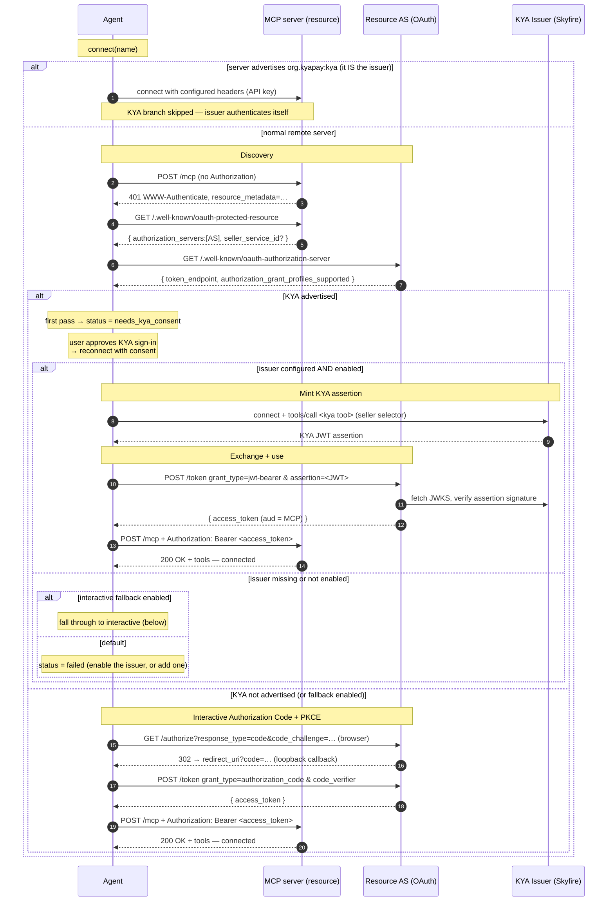

# KYA + OAuth + MCP Integration — Technical Specification

How an autonomous agent authenticates to a protected MCP server using the KYA
(Know Your Agent) grant profile, when it falls back to interactive OAuth, and how
the same capability machinery is reused to mint payment tokens
(`org.kyapay:pay`). It describes the roles, data structures, and network
exchanges involved, independent of any particular client implementation.

> This is the design reference. For a hands-on operations description (running a
> protected resource and authorization server, configuring the issuer, reading
> the logs), see [KYA.md](KYA.md). Where the two overlap, this doc is
> authoritative on behavior and KYA.md on operation.

---

## 1. Purpose & Background

MCP (Model Context Protocol) remote servers are HTTP resources that may require
OAuth 2.1 authorization. The standard flow for an unauthenticated server is the
interactive **Authorization Code + PKCE** flow: open a browser, the user
consents, an authorization code returns to a loopback redirect, and the code is
exchanged for an access token.

That flow assumes a _human_ is present to consent. An autonomous agent has no
browser session to drive, so it needs a **non-interactive** way to obtain an
access token in which the **agent's identity** (not a human's browser session)
is what the resource server authorizes. That is what **KYA** provides:

1. A trusted **issuer** mints a signed **KYA assertion** (a JWT) attesting to the
   agent's identity and the seller it wants to act against. (Skyfire's MCP server
   is the issuer in the reference deployment.)
2. The agent exchanges that assertion at the resource's **Authorization Server**
   (AS) for a normal OAuth access token, using RFC 7523's
   `urn:ietf:params:oauth:grant-type:jwt-bearer` grant.
3. The agent uses that access token as a plain `Bearer` credential against the
   MCP server, which validates it as an ordinary OAuth 2.1 resource server with
   **no KYA awareness**.

KYA is therefore a _non-interactive optimization layered on top of standard
OAuth_. When a server doesn't advertise KYA (or KYA minting can't be performed),
the agent falls back to the interactive flow.

The same "configured capability → issuer MCP tool" machinery is reused at
**tool-call time** to mint _payment_ tokens (`org.kyapay:pay`) mid-conversation.
That sibling feature is documented in §12.

---

## 2. Terminology & Actors

| Term                      | Meaning                                                                                                                                                            |
| ------------------------- | ---------------------------------------------------------------------------------------------------------------------------------------------------------------- |
| **Agent**                 | The autonomous MCP client that connects to remote MCP servers on a user's behalf.                                                                                |
| **MCP server / Resource** | The protected remote MCP server the agent wants to use. A plain OAuth 2.1 resource server.                                                                        |
| **Resource AS**           | The OAuth Authorization Server protecting the resource. Hosts discovery metadata + the `/token` endpoint.                                                         |
| **KYA Issuer**            | A remote MCP server advertising capability `org.kyapay:kya` and exposing a tool (e.g. `create-kya-token`) that mints KYA assertions. Skyfire's MCP server in the reference deployment. |
| **KYA assertion**         | A signed JWT minted by the issuer, attesting agent identity + seller. _Not_ an OAuth access token.                                                                |
| **Access token**          | A normal OAuth 2.1 Bearer token issued by the Resource AS in exchange for the assertion.                                                                          |
| **Capability**            | A URI like `org.kyapay:kya` or `org.kyapay:pay` declared in config, mapped to the issuer tool that fulfills it.                                                   |
| **Seller selector**       | The argument passed to the issuer tool identifying the seller: either `sellerServiceId` (a UUID) or `sellerDomainOrUrl` (a hostname).                             |

**Relevant RFCs / specs:**

- **RFC 9728** — OAuth 2.0 Protected Resource Metadata (`/.well-known/oauth-protected-resource`).
- **RFC 8414** — OAuth 2.0 Authorization Server Metadata (`/.well-known/oauth-authorization-server`).
- **RFC 7523** — JWT Profile for OAuth Client Authentication and Authorization Grants (`grant_type=…:jwt-bearer`).
- **RFC 7591** — OAuth 2.0 Dynamic Client Registration (used only in the interactive fallback).
- **RFC 7636** — PKCE (interactive fallback).
- **KYA / ID-JAG grant profile drafts** — advertised via `authorization_grant_profiles_supported` in AS metadata; profile URN `urn:ietf:params:oauth:grant-profile:kya`.

The flow has three steps: **discovery** (find the Resource AS and read its grant
profiles), **mint** (create the KYA assertion at the issuer), and **exchange** (swap
the assertion for an access token and use it).

---

## 3. Architecture Overview

Three network parties cooperate, with the agent orchestrating:

- The **agent** holds configuration for both the target MCP server(s) and the KYA
  issuer, owns the connection lifecycle, and performs discovery, minting, and the
  token exchange.
- The **Resource AS** publishes discovery metadata (whether it supports KYA) and
  exchanges a KYA assertion for an access token.
- The **KYA issuer** mints assertions on request, authenticated by the agent's
  issuer credential (e.g. an API key).

### 3.1 High-level data flow

```
   user action ─▶ connect(server)
                       │
                       ▼ (401 / Unauthorized)
                 silent KYA flow ──── discovery ───────────────┐
                       │                                      ▼
                       │                             Resource AS metadata
                       ▼ mint                                     
                 KYA Issuer ── create-kya-token ─▶ KYA JWT assertion
                       ▼ exchange                                 
                 Resource AS /token (jwt-bearer) ─▶ access_token
                       ▼
                 persist token (keyed by resource origin)
                       ▼
                 retry transport w/ Bearer ─▶ connected
```

The agent never calls the issuer's REST APIs directly; minting always goes
through an **MCP tool call** on the issuer server. This keeps the issuer's
credential (the API key) on the issuer connection only.

---

## 4. Configuration Model

### 4.1 Remote server entry

A remote MCP entry describes how to reach a server and (optionally) how it
authenticates:

```jsonc
{
  "type": "remote",
  "url": "https://merchant.example.com/mcp",
  "transport": "streamable_http",      // optional: "streamable_http" | "sse"
  "enabled": true,                      // optional
  "headers": { "x-custom": "…" },       // optional, sent on every request
  "oauth": { /* … */ } | false,         // optional; false disables OAuth auto-detect
  "timeout": 30000,                     // optional, ms
  "capabilities": { /* … */ }           // optional, see §5
}
```

Optional OAuth sub-config (used by the interactive fallback):

```jsonc
"oauth": {
  "clientId": "…",        // pre-registered client; skips dynamic registration
  "clientSecret": "…",
  "scope": "…",
  "callbackPort": 19876,  // shorthand for redirectUri port
  "redirectUri": "http://127.0.0.1:19876/mcp/oauth/callback"
}
```

### 4.2 The `capabilities` schema

`capabilities` maps a capability URI to the issuer tool that fulfills it:

```jsonc
"capabilities": {
  "org.kyapay:kya": { "tool": "create-kya-token" },
  "org.kyapay:pay": { "tool": "create-pay-token" }
}
```

The `tool` value names the MCP tool on that server which mints the token for the
capability. A capability entry without a usable `tool` cannot mint and is
ignored.

### 4.3 Example configuration

```jsonc
{
  "mcp": {
    "merchant": {
      "type": "remote",
      "url": "https://merchant.example.com/mcp",
    },
    "skyfire": {
      "type": "remote",
      "url": "https://mcp.skyfire.xyz/mcp",
      "capabilities": {
        "org.kyapay:kya": { "tool": "create-kya-token" },
        "org.kyapay:pay": { "tool": "create-pay-token" },
      },
      "headers": {
        "skyfire-api-key": "{env:SKYFIRE_API_KEY}",
      },
    },
  },
}
```

The issuer (`skyfire`) authenticates itself via its `skyfire-api-key` header. It
never enters the KYA branch — you don't mint a KYA token to talk to the KYA
issuer (see §7.1).

> **Security:** API keys must never be committed. Use environment interpolation
> (e.g. `{env:SKYFIRE_API_KEY}`) and supply the secret at runtime.

---

## 5. Capability Model & Issuer Selection

### 5.1 Detecting the KYA capability

A server is KYA-capable when its `capabilities` map contains the key
`org.kyapay:kya`. `org.kyapay:kya` is the single capability URI used for KYA
issuance.

### 5.2 Selecting the issuer

The agent scans its whole MCP config and selects the **first remote server**
that (a) advertises the KYA capability and (b) resolves to a non-empty tool name.
An issuer is identified by `{ name, config, tool }`.

Key properties:

- **Selection is by capability, not by server name.** The example server is named
  `skyfire`, but any name works.
- **Tool resolution** uses `capabilities["org.kyapay:kya"].tool`. If that is
  empty or missing, the server is **not** treated as an issuer.
- **First match wins** — if multiple servers advertise KYA, configuration order
  decides.

### 5.3 The capability map (for payments) and issuer hiding

A capability map `{ [capabilityURI]: { server, tool } }` is built across all
configured servers. It drives two things:

- **Payment routing** (§12), and
- **Provider hiding:** any server that appears as a capability provider is
  **excluded from the toolset exposed to the model**, so the model cannot call
  `create-kya-token` / `create-pay-token` directly and bypass the gateway.

---

## 6. Connection Lifecycle & Status Model

### 6.1 Status values

A server's connection state is a small discriminated set:

| Status                      | Meaning                                                                                                |
| --------------------------- | ------------------------------------------------------------------------------------------------------ |
| `connected`                 | Client connected, tools listed and cached.                                                             |
| `disabled`                  | Disabled in config, or explicitly disconnected.                                                        |
| `not_connected`             | Configured but never connected this session.                                                           |
| `needs_kya_consent`         | The server advertises KYA, but the user hasn't approved a KYA sign-in. Reconnect with consent.         |
| `needs_auth`                | Auth required; interactive OAuth available (KYA not advertised, or fallback enabled).                  |
| `needs_client_registration` | Server requires a pre-registered client; dynamic client registration unsupported.                     |
| `failed`                    | Connection or KYA minting failed; carries an error string.                                             |

### 6.2 Connections are lazy

The agent does **not** eagerly connect servers at startup. A connection (and any
KYA it triggers) happens on demand when the user enables a server.

### 6.3 Entry point, consent, and the issuer gate

KYA has **two** entry points that share the same mint machinery (§7), differing only
in *when* the challenge arrives:

- **Connect-time** — the handler that fires when a transport connect returns an
  **Unauthorized (401)** and the guards in §7.1 pass (described in this section).
- **Tool-call-time** — a 401 (or an auth-required tool result) on a *later* tool call,
  after the agent has already connected unauthenticated (see §6.5).

The connect-time handler drives detection, the consent gate, the issuer check, and the
mint. Connecting a KYA-protected server therefore takes two passes:

1. **First connect (no consent).** The handler runs discovery (§7.2). If the
   server advertises KYA, it stops at `needs_kya_consent` rather than minting —
   KYA carries the agent's identity, so the user approves it explicitly before
   any token is minted.

2. **Reconnect with consent.** The client reconnects with a consent flag. This
   time the handler passes the consent check and proceeds to the **issuer gate**:
   the configured KYA issuer must itself be enabled (connected). If it isn't, the
   connect fails with a message telling the user to enable it — connecting the
   issuer is what validates its config and API key, and this keeps KYA from
   minting through an issuer the user never enabled. (This mirrors the payment
   gateway, which only mints through a connected provider — §12.) With the issuer
   enabled, the handler runs the silent KYA flow (§7) and retries the transport on
   success.

### 6.4 Transport selection

The agent tries **StreamableHTTP first, then SSE**. Important nuances:

- A 401 on the StreamableHTTP attempt **disables the SSE fallback** — the server
  clearly speaks HTTP and just needs auth, so falling back to SSE (which would
  404) would mask the real auth/KYA failure.
- KYA is only attempted on the **StreamableHTTP** branch, once per connect, and
  only when the §7.1 guards pass.
- A transport cannot be reused after a failed connect, so the post-KYA retry
  builds a **fresh** StreamableHTTP transport; the credential layer now returns
  the token the silent flow just stored.

### 6.5 Tool-call-time challenge

A server need not reject the *connection*. It can accept an unauthenticated connect —
`initialize`, `tools/list`, and any **open** tools all succeed with no token — and
challenge only when a **protected** tool is called. The agent handles this lazily, in
the wrapper around each tool's `execute`:

- If a tool call surfaces an auth failure **and** the server advertises KYA, the agent
  runs the same silent KYA flow (§7) and, on success, **retries that same tool call**
  with the now-stored Bearer token. The result of the retry is returned to the model.
- The failure is recognized two ways, because servers signal it differently:
  - a **thrown 401** — `UnauthorizedError`, or an error carrying `code === 401` /
    a `401`/`unauthorized` message; or
  - a **tool result flagged `isError`** whose text indicates auth is required
    (`unauthorized`, `forbidden`, `401`, `sign-in`, `kya`, …). Detecting this form
    matters because some resources return a normal `200` result flagged `isError`
    with a sign-in message instead of a transport 401.
- The mint goes through the same **enabled-issuer gate** as the connect-time path
  (§6.3): no usable issuer → the call is gated with a sign-in message rather than
  silently failing. The §7.1 transport guards are connect-specific and don't apply
  here; the tool-call path keys off KYA advertisement (§7.2) plus the issuer gate.
- The stored token is reused for the rest of the session, so subsequent protected
  calls don't re-challenge.

A single server can therefore mix open and protected tools, and KYA fires the moment
the agent first touches a protected one — not necessarily at connect.

---

## 7. The Silent KYA Flow

The silent KYA flow returns one of three outcomes:

```
minted: true,  kyaAdvertised: true                 // success
minted: false, kyaAdvertised: false                // KYA not advertised → caller may fall back
minted: false, kyaAdvertised: true, error: "…"     // KYA advertised but minting failed → hard fail
```

The `kyaAdvertised` flag drives the gating logic (§9): it tells the caller whether
a failure should hard-fail or fall through to interactive OAuth.

### 7.1 When the KYA branch runs (guards)

The 401 handler only enters the KYA branch when **all** of these hold:

- the failing attempt is **StreamableHTTP** (not SSE);
- KYA hasn't already been retried this connect;
- the server does **not** itself advertise KYA — the issuer authenticates with its
  own API-key header, so minting a KYA token just to reach the KYA minter would be
  a chicken-and-egg deadlock;
- OAuth isn't explicitly disabled (`oauth !== false`);
- the server has no static `headers` configured — a server you authenticate with
  your own header/API key isn't a KYA target.

Servers that fail any guard skip KYA entirely and follow the ordinary connect/auth
path.

### 7.2 Discovery & advertisement gate

Discovery is shared by both the consent gate (§6.3) and the mint preflight. It
yields `{ supportsKya, authServer, sellerServiceId }`:

1. **Probe.** `POST <serverUrl>` with a minimal JSON-RPC `initialize` body
   and no `Authorization`. If the response is `401`, read the
   `resource_metadata="…"` pointer from the `WWW-Authenticate` header (RFC 9728).
   If there's no 401 or no pointer, fall back to the default well-known location:
   `<origin>/.well-known/oauth-protected-resource`.

2. **Protected-resource metadata.** `GET` the resource-metadata URL. The
   response is expected to contain:
   - `authorization_servers: string[]` → the Resource AS origin (`[0]`).
   - optionally `seller_service_id` → a seller identity the resource advertises for
     itself. If there's no auth server, `supportsKya: false` and the flow
     short-circuits.

3. **AS metadata.** `GET <authServer>/.well-known/oauth-authorization-server`
   (RFC 8414), falling back to `/.well-known/openid-configuration`. Read
   `authorization_grant_profiles_supported` and check whether it advertises the KYA
   profile (normalizing both the full URN `urn:ietf:params:oauth:grant-profile:kya`
   and the short token `kya`).

**The advertisement gate:** if the profiles do not include `kya`, `supportsKya` is
false and the flow returns `{ minted: false, kyaAdvertised: false }` — KYA is
skipped and the caller may fall back to interactive OAuth. Once past this gate, any
_subsequent_ thrown failure is reported as `kyaAdvertised: true` (see §7.6).

> All of discovery is wrapped so a discovery/network failure degrades to "KYA not
> advertised," not a hard error.

### 7.3 Seller selector resolution

The issuer tool requires **exactly one** seller selector. Priority:

1. **Explicit override** (a configured `sellerServiceId` UUID) → `{ sellerServiceId }`.
2. **`seller_service_id`** advertised by the protected-resource metadata → `{ sellerServiceId }`.
3. **Derived from the target MCP URL** → `{ sellerDomainOrUrl }`: the target's
   hostname, except **loopback / RFC 1918 private ranges** are substituted with a
   placeholder domain registered in the issuer's seller directory (because the
   directory can't resolve localhost). The recognized "local" set: `localhost`,
   `127.0.0.1`, `::1`, `0.0.0.0`, `*.localhost`, `127.*`, `10.*`, `192.168.*`,
   `172.16–31.*`.

### 7.4 Mint the KYA assertion

1. If no issuer is configured → return `{ minted: false, kyaAdvertised: true, error: "KYA supported but no issuer configured…" }`.
2. Connect to the issuer via a StreamableHTTP transport carrying the issuer's
   `headers` (the API key).
3. `callTool({ name: issuer.tool, arguments: sellerSelector })`, closing the issuer
   client afterward.
4. Concatenate the text content of the result and extract the JWT — a three-segment
   `xxx.yyy.zzz` token. (The issuer tool may return a human-readable string such as
   `"Creation of KYA token for <id> is complete: <jwt>"`.) No JWT → error result.

### 7.5 Exchange & store

1. **Read the AS `token_endpoint`** from the AS metadata. Missing → error result.
2. `POST <token_endpoint>` with `content-type: application/x-www-form-urlencoded`
   and body:

   ```
   grant_type=urn:ietf:params:oauth:grant-type:jwt-bearer
   assertion=<kya_jwt>
   ```

   A non-2xx throws `OAuth token exchange failed (<status>): <body>`.

   > **The exchange is client-unauthenticated.** The request carries _only_
   > `grant_type` and `assertion` — there is **no** `client_id`/`client_secret`, no
   > `Authorization` header, and **no `scope` parameter**. All trust derives from
   > the issuer-signed assertion; the AS validates its signature, issuer, expiry,
   > and replay (`jti`). Because no scope is requested, the AS assigns a default
   > scope.

3. Read **`access_token`** from the JSON response. Missing → error result.

   > **The rest of the token response is discarded.** Even though the AS returns
   > `expires_in`, `scope`, and possibly `refresh_token`, the silent path persists
   > only the access token. See §7.7 for the consequences (no local expiry
   > tracking, no refresh).

4. Persist the token **keyed by the server's URL origin**, matching the
   normalization the credential layer uses (§8.1), so a later lookup finds it.
5. Return `{ minted: true, kyaAdvertised: true }`.

### 7.6 Failure semantics & the advertised flag

- If discovery passed the §7.2 advertisement gate, any thrown failure (issuer
  connect, tool call, token exchange) becomes
  `{ minted: false, kyaAdvertised: true, error }`. This is deliberate: a genuine
  KYA failure must **not** silently degrade to interactive OAuth.
- Otherwise → `{ minted: false, kyaAdvertised: false }`.

### 7.7 Lifetime of a KYA-minted token (no local expiry, no refresh)

Because the exchange stores no `expiresAt` and no `refreshToken`:

- The token reads as **authenticated indefinitely** in status checks — even after
  the AS-issued `expires_in` has actually elapsed.
- The agent therefore does **not** proactively re-mint on a timer. A stale token is
  replaced only when the **MCP server rejects it with a 401**, which re-enters the
  connect flow and runs the silent KYA flow again (a fresh mint).
- There is no refresh-token path for KYA tokens; "refresh" is always a full re-mint
  via the issuer.

---

## 8. The OAuth Client-Provider Role

The agent supplies an OAuth client-provider to the MCP transport, used for both
the auto-connect transport and the interactive flow. Its responsibilities:

### 8.1 URL/origin normalization

Normalize the server URL to its **origin**. The transport treats the provider's
server URL as the _origin_ where `/.well-known/*` lives, but MCP transport URLs
often include a `/mcp` path. Normalizing to the origin ensures (a) discovery
doesn't 404 on `/mcp/.well-known/*`, and (b) tokens stored out-of-band by KYA
(keyed by origin) are matched on lookup.

### 8.2 Token & client storage

- **Token read** returns the stored entry **only if its stored origin matches** —
  preventing token reuse across a changed URL.
- **Token save** persists access/refresh/expiry/scope.
- **Client information** prefers a configured `clientId`, else a stored
  dynamically-registered client (re-registering if the secret expired).
- **PKCE/CSRF state** (`codeVerifier`, `state`) is persisted; `state` is minted
  randomly if none is saved.

### 8.3 Discovery via `WWW-Authenticate`

The provider may proactively `POST` to the origin to provoke a 401, then surface
an Unauthorized error so the transport parses the advertised metadata. This avoids
a confusing "Invalid OAuth error response" when an MCP origin returns a plain-text
404 for `/.well-known/*`.

### 8.4 Grant-profile hooks are intentionally inert

The SDK's grant-profile hooks **return nothing by design**. The KYA jwt-bearer
exchange is **not** driven through those hooks; it runs out of band in the silent
KYA flow, which discovers, mints, exchanges, and stores the token _before_ the
transport is retried. This keeps the silent flow authoritative and lets the SDK
fall back to interactive `authorization_code` when KYA is unavailable.

---

## 9. Decision Matrix (Gating Logic)

For an auth-required remote server that passes the §7.1 guards, the 401 handler
resolves in this order. "Usable issuer" means an issuer is configured **and**
enabled (connected).

| KYA advertised? | Consent given? | Usable issuer?     | Interactive fallback enabled? | Outcome                                       |
| --------------- | -------------- | ------------------ | ----------------------------- | --------------------------------------------- |
| No              | —              | —                  | —                             | **Interactive OAuth** (`needs_auth`)          |
| Yes             | no             | —                  | —                             | **`needs_kya_consent`** (await user approval) |
| Yes             | yes            | yes → mint ok      | —                             | **Connected** via Bearer                      |
| Yes             | yes            | yes → mint fails   | —                             | **`failed`** (clear KYA error)                |
| Yes             | yes            | no                 | unset (default)               | **`failed`** (enable the issuer, or add one)  |
| Yes             | yes            | no                 | set                           | **Interactive OAuth** (`needs_auth`)          |

Rationale: KYA is the intended non-interactive path. Silently dropping to a browser
prompt when KYA was _supposed_ to work would hide real failures, so the default is
"KYA or bust" with an explicit opt-out (the interactive-fallback toggle). Requiring
consent and an enabled issuer keeps minting deliberate and tied to a validated
issuer.

---

## 10. Interactive OAuth Fallback

When the matrix lands on interactive OAuth, the flow is the standard Authorization
Code + PKCE, driven by the transport's OAuth client-provider and a loopback
callback server.

### 10.1 Start

1. Validate the server is remote with OAuth enabled.
2. Resolve the effective redirect URI: `oauth.redirectUri` >
   `http://127.0.0.1:<callbackPort>/mcp/oauth/callback` > a default port.
3. Start the loopback callback server.
4. Generate and persist a random state value.
5. Build a provider whose redirect hook captures the authorization URL, attempt a
   transport connect, and on Unauthorized return the captured URL.

### 10.2 Authenticate

- If the start step returned **no** URL (already authorized), list tools and store
  the client directly.
- Otherwise open the browser at the authorization URL, wait for the loopback
  callback, **validate the returned state against the stored state** (CSRF
  defense), and finish.
- If the browser can't be opened, surface an event so the URL can be printed for
  manual opening.

### 10.3 Finish

Retrieve the pending transport, exchange the code at `/token` with the PKCE
verifier (the SDK does this and stores tokens via the provider), clear the code
verifier, and store the now-authenticated client.

### 10.4 The callback server

A singleton `http` server on the redirect port. Key behaviors:

- Only the configured callback path is honored; everything else 404s.
- **State is mandatory** — a missing or unknown state is rejected as a potential
  CSRF attack.
- Pending callbacks are keyed by state, with a reverse `server → state` index so a
  pending request can be cancelled. Default timeout: **5 minutes**.
- Serves friendly success/error HTML; the success page auto-closes the tab.

> **Loopback limitation:** the redirect lands on `127.0.0.1:<port>` on the **agent**
> host. The interactive flow therefore only completes when the browser and agent
> share a machine, unless a custom `oauth.redirectUri` is configured. The silent KYA
> flow has no such limitation (no browser).

---

## 11. Token Storage

Tokens, client registrations, and PKCE/CSRF state are persisted to a
mode-restricted store outside the project tree (e.g. owner-only, mode `0o600`).
Each entry holds:

```
{ tokens?, clientInfo?, codeVerifier?, oauthState?, serverUrl? }
```

- `tokens` = `{ accessToken, refreshToken?, expiresAt?, scope? }`.
- `serverUrl` is stamped on write and checked on read — the mechanism that binds a
  token to a specific origin and lets the KYA-stored token (keyed by origin) be
  picked up by the credential layer.
- Expiry check: no token → unknown; no expiry → not expired; else `expiresAt < now`.

Clearing the store forces a clean re-auth on the next connect.

---

## 12. Payment Capability (`org.kyapay:pay`) — Sibling Feature

The same capability machinery is reused at **tool-call time** to mint _payment_
tokens. When any capability is configured, each tool call routes through a gateway
wrapper:

1. Call the requested tool normally.
2. If the result is an error carrying a `payments/*` signal in `_meta` — settlement
   types, total, currency, optional seller id/search — the gateway intercepts.
3. Match a settlement type to a provider via longest-prefix match against the
   capability map.
4. Resolve the seller id (from the signal, or via the issuer's seller-lookup tool).
5. Call the issuer's pay tool (e.g. `create-pay-token`), forwarding amount/currency
   in `_meta`. If the issuer returns a **mandate** signal, open the mandate URL in a
   browser and ask the user to retry.
6. Cache the minted token (keyed by settlement type/total/currency, with a small
   pre-expiry guard).
7. Retry the original tool with `payments/settlement/token` injected in `_meta`.

The gateway shares the issuer-hiding rule (§5.3): provider servers are excluded
from the model-visible toolset so the model can't call the mint tools directly.

> **KYA vs. pay:** KYA mints an _auth_ assertion to _connect_ to a server; pay mints
> a _payment_ token to _settle a transaction_ with an already-connected server. Both
> go through the same configured issuer; only the capability URI and tool differ.

---

## 13. Configuration Options

Two behaviors are configurable (e.g. via environment), evaluated at access time:

| Option                  | Effect                                                                                                                                                                          |
| ----------------------- | ----------------------------------------------------------------------------------------------------------------------------------------------------------------------------- |
| **Seller-service-id override** | Pins the seller selector to a specific `sellerServiceId` UUID, overriding URL-derived selection.                                                                       |
| **Interactive-fallback toggle** | When enabled, an auth-required server that advertises KYA but has **no configured issuer** falls through to interactive OAuth instead of hard-failing. Does **not** affect the "no KYA advertised" case (always falls back) or the "mint failed" case (always hard-fails). |

---

## 14. Client Surfaces

Any client surface ultimately issues the same connect/auth operations against the
agent and runs the same KYA detection + consent gate. Typical surfaces:

- **Toggle / connect UI.** On enabling a server:
  - `connected` → disconnect.
  - `needs_kya_consent` → open a KYA consent prompt ("Use your KYA identity to sign
    in to _name_?"). Approving reconnects with the consent flag, which mints and
    connects.
  - `needs_auth` → run the **interactive** flow (opens browser on the agent host;
    see §10.4 loopback caveat).
  - otherwise → connect.

- **HTTP API.** A connect endpoint (first call on a KYA server returns
  `needs_kya_consent`; a consent flag approves the sign-in and mints) and a status
  endpoint.

- **CLI.** List servers + status, run interactive OAuth, log out, add config, and a
  standalone diagnostic that probes the server and, on 401, runs a self-contained
  KYA mint to prove the path end to end.

---

## 15. Reference Test Harness

A self-contained mock of the protected MCP server **and** Resource AS is useful for
end-to-end testing:

| Server            | Endpoints                                                                                                                                              |
| ----------------- | ------------------------------------------------------------------------------------------------------------------------------------------------------ |
| **Mock MCP**      | `GET /.well-known/oauth-protected-resource` (→ AS), `POST /mcp` (Bearer-protected JSON-RPC: `initialize`, `tools/list`, `tools/call`).                  |
| **Mock OAuth AS** | `GET /.well-known/oauth-authorization-server` & `/openid-configuration`, `GET /authorize` (auto-approving, PKCE), `POST /register` (DCR), `POST /token` (jwt-bearer **and** authorization_code), `POST /introspect`. |

Recommended behaviors for a faithful harness:

- A toggle to **drop `kya`** from `authorization_grant_profiles_supported` and
  `jwt-bearer` from `grant_types_supported`, turning the AS into a plain OAuth
  server — that's how you exercise the interactive fallback.
- The AS **verifies the KYA assertion's signature** against the issuer's live JWKS
  and `iss`, **pins the algorithm** (issuers sign with `ES256`), checks the header
  `typ` and the common claims (`env`, `iat`, `jti`, `exp`), optionally the seller
  domain (`sdm`), rejects replayed `jti`s, and requires identity claims (`aid`/`hid`).
- The issued access token's `aud` is set to the MCP resource URI; the mock MCP
  validates signature + `iss` + `aud` + `sub` + `exp` + `scope` before serving.
- The 401 challenge advertises the AS metadata via
  `WWW-Authenticate: Bearer realm="mcp", authorization-uri="…/.well-known/oauth-authorization-server"`.

---

## 16. End-to-End Sequence



The diagram shows the challenge arriving at connect. The **tool-call-time** variant
(§6.5) is the same mint/exchange, just triggered later: the connect at the top
succeeds with no token, the agent calls open tools normally, and the `401` (or
`isError` sign-in result) arrives on the first **protected `tools/call`** — at which
point the mint runs and the agent retries that tool call with the Bearer token.

---

## 17. Error Handling & Edge Cases

| Situation                            | Behavior                                            |
| ------------------------------------ | --------------------------------------------------- |
| Invalid MCP URL                      | `failed` immediately                                |
| Discovery/network error              | Treated as "KYA not advertised" → fallback eligible |
| KYA advertised, not yet consented    | `needs_kya_consent` (await approval)                |
| Issuer configured but not enabled    | `failed` ("enable it, then retry")                  |
| KYA advertised, no usable issuer     | `failed` with actionable message                    |
| Issuer returns non-JWT text          | `failed` "Could not extract JWT assertion…"         |
| AS metadata missing `token_endpoint` | `failed`                                            |
| Token exchange non-2xx               | `failed` with status + body                         |
| 401 on StreamableHTTP                | No SSE fallback; auth path only                     |
| Server needs pre-registered client   | `needs_client_registration`                         |
| Interactive: missing/invalid state   | Callback rejected (CSRF)                            |
| Interactive: state mismatch          | "OAuth state mismatch"                              |
| Browser won't open                   | Surface an event; print URL for manual opening      |
| Callback timeout                     | Reject after 5 min                                  |
| Token bound to wrong origin          | Token lookup returns nothing → re-auth              |

---

## 18. Security Considerations

- **No secrets in the repo.** The issuer's API key is supplied via environment
  interpolation; tokens are stored mode-restricted outside the project tree.
- **CSRF.** Interactive OAuth enforces `state` both at the callback server and again
  in the authenticate step (the stored value must match the returned one).
- **PKCE.** The interactive flow uses `S256` code challenges.
- **Audience binding.** The AS sets the access token's `aud` to the MCP resource's
  canonical URI; the resource validates it as a plain OAuth resource server. A token
  minted for resource X cannot be replayed against resource Y.
- **Origin binding of stored tokens.** Token lookup is origin-checked, preventing a
  token saved for one origin from being presented to another.
- **Assertion validation.** The Resource AS validates the KYA assertion's signature
  against the issuer's JWKS (pinned algorithm), the issuer, the claim shapes, and
  rejects duplicate `jti`s (replay protection).
- **No silent downgrade.** When KYA is advertised, a mint failure surfaces as a hard
  error rather than quietly prompting a human — preventing a downgrade where a
  failing agent flow becomes an interactive one.
- **Issuer tool hiding.** Capability-provider servers' tools are withheld from the
  model's toolset so it can't mint tokens directly and bypass the gateway.

---

## 19. Testing

- **Silent KYA (default):** run the harness with KYA advertised, configure a
  protected server + a KYA issuer, connect → expect `connected` with no browser.
- **Interactive fallback:** run the harness with KYA disabled, configure only the
  protected server (no issuer) → connect yields `needs_auth`; complete via the
  interactive auth command. (No fallback toggle needed because KYA isn't advertised.)
- **"KYA advertised, no issuer" fallback:** run the harness _with_ KYA, omit the
  issuer, enable the interactive-fallback toggle → falls through to interactive
  instead of failing.
- **Diagnostics:** the standalone debug command mints + proves a token end to end.

---

## 20. Known Limitations

- **Interactive flow is local-only by default.** The loopback redirect lands on the
  agent host. A truly remote client needs a split start → open-in-user-browser →
  callback flow with a client-hosted redirect.
- **Issuer output parsing is regex-based.** The agent scrapes a JWT out of a
  human-readable issuer-tool result. A structured tool result would be more robust.
- **First-issuer-wins.** Multiple KYA issuers aren't disambiguated beyond config
  order.
- **No local expiry tracking or refresh for KYA-minted tokens.** Only the access
  token is stored, so it reads as `authenticated` indefinitely and is re-minted only
  when the MCP server rejects the stale token with a 401. See §7.7.
- **Seller placeholder for local targets.** Loopback/private targets are mapped to a
  placeholder domain; real deployments must register their domain (or pin a
  `sellerServiceId`) in the issuer's seller directory.
