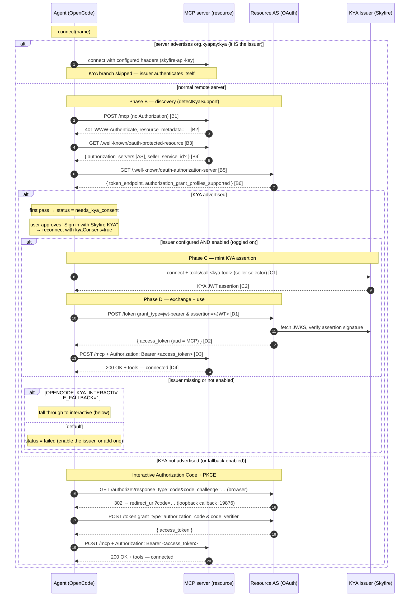

# KYA + OAuth + MCP Integration — Technical Specification

How OpenCode authenticates to protected MCP servers with the KYA (Know Your
Agent) grant profile, when it falls back to interactive OAuth, and how the
payment gateway (`org.kyapay:pay`) reuses the same capability machinery. It
covers the code paths, data structures, and network exchanges involved, for
engineers working on the MCP transport, auth, and gateway layers.

> This is the design reference. For a hands-on runbook (starting the mock
> servers, connecting from the web UI, reading the logs), see [KYA.md](KYA.md).
> Where the two overlap, this doc is authoritative on behavior and KYA.md on
> operation.

---

## 1. Purpose & Background

MCP (Model Context Protocol) remote servers are HTTP resources that may require
OAuth 2.1 authorization. The standard MCP SDK flow for an unauthenticated server
is the interactive **Authorization Code + PKCE** flow: open a browser, the user
consents, an authorization code comes back to a loopback redirect, and the code
is exchanged for an access token.

That flow assumes a _human_ is present to consent. OpenCode acts as an
**autonomous agent**, so we want a **non-interactive** way to obtain an access
token where the agent's identity (not a human's browser session) is what the
resource server authorizes. That is what **KYA** provides:

1. A trusted **issuer** (Skyfire's MCP server) mints a signed **KYA assertion**
   (a JWT) that attests to the agent's identity and the seller it wants to act
   against.
2. OpenCode exchanges that assertion at the resource's **Authorization Server**
   (AS) for a normal OAuth access token, using RFC 7523's
   `urn:ietf:params:oauth:grant-type:jwt-bearer` grant.
3. OpenCode uses that access token as a plain `Bearer` credential against the
   MCP server, which validates it as an ordinary OAuth 2.1 resource server with
   **no KYA awareness**.

KYA is therefore a _non-interactive optimization layered on top of standard
OAuth_. When a server doesn't advertise KYA (or KYA minting can't be performed),
OpenCode falls back to the interactive flow.

The same "config capability → issuer MCP tool" machinery is reused at
**tool-call time** by the **payment gateway** (`org.kyapay:pay`) to mint
_payment_ tokens mid-conversation. That is a sibling feature documented in
§12.

---

## 2. Terminology & Actors

| Term                      | Meaning                                                                                                                                                                           |
| ------------------------- | --------------------------------------------------------------------------------------------------------------------------------------------------------------------------------- |
| **Agent**                 | OpenCode itself (the instance server process).                                                                                                                                    |
| **MCP server / Resource** | The protected remote MCP server the agent wants to use (e.g. `merchant-mcp`). A plain OAuth 2.1 resource server.                                                                  |
| **Resource AS**           | The OAuth Authorization Server protecting the resource. Hosts discovery metadata + the `/token` endpoint.                                                                         |
| **KYA Issuer**            | A remote MCP server that advertises capability `org.kyapay:kya` and exposes a tool (e.g. `create-kya-token`) that mints KYA assertions. In practice this is Skyfire's MCP server. |
| **KYA assertion**         | A signed JWT minted by the issuer, attesting agent identity + seller. _Not_ an OAuth access token.                                                                                |
| **Access token**          | A normal OAuth 2.1 Bearer token issued by the Resource AS in exchange for the assertion.                                                                                          |
| **Capability**            | A URI like `org.kyapay:kya` or `org.kyapay:pay` declared in config, mapped to the issuer tool that fulfills it.                                                                   |
| **Seller selector**       | The argument passed to the issuer tool identifying the seller: either `sellerServiceId` (a UUID) or `sellerDomainOrUrl` (a hostname).                                             |

**Relevant RFCs / specs:**

- **RFC 9728** — OAuth 2.0 Protected Resource Metadata (`/.well-known/oauth-protected-resource`).
- **RFC 8414** — OAuth 2.0 Authorization Server Metadata (`/.well-known/oauth-authorization-server`).
- **RFC 7523** — JWT Profile for OAuth Client Authentication and Authorization Grants (`grant_type=…:jwt-bearer`).
- **RFC 7591** — OAuth 2.0 Dynamic Client Registration (used only in the interactive fallback).
- **RFC 7636** — PKCE (interactive fallback).
- **KYA / ID-JAG grant profile drafts** — advertised via `authorization_grant_profiles_supported` in AS metadata; profile URN `urn:ietf:params:oauth:grant-profile:kya`.

Phase labels **B / C / D** used throughout map to the Skyfire×Okta design spec:

- **Phase B** — discovery (find the Resource AS and read its grant profiles).
- **Phase C** — mint the KYA assertion at the issuer.
- **Phase D** — exchange the assertion for an access token and use it.

---

## 3. Architecture Overview

### 3.1 Component / file map

| File                                                                                                                                                                                         | Responsibility                                                                                                                                                                                                                                                                                                                            |
| -------------------------------------------------------------------------------------------------------------------------------------------------------------------------------------------- | ----------------------------------------------------------------------------------------------------------------------------------------------------------------------------------------------------------------------------------------------------------------------------------------------------------------------------------------- |
| [packages/opencode/src/mcp/index.ts](../packages/opencode/src/mcp/index.ts)                                                                                                                  | The `MCP` Effect service. Owns connection lifecycle, KYA detection (`detectKyaSupport`), the consent + issuer gates, the mint orchestration (`trySilentKya`), transport selection, status state, and the interactive-auth entry points (`startAuth`/`authenticate`/`finishAuth`).                                                          |
| [packages/opencode/src/mcp/kya.ts](../packages/opencode/src/mcp/kya.ts)                                                                                                                      | Pure KYA helpers: capability detection, issuer selection from config, JWT extraction, RFC 9728/8414 discovery, RFC 7523 token exchange. **Note:** its `discoverResourceAuthServer` + `exchangeAssertionForAccessToken` are used by the CLI `mcp debug` path only; the silent connect path in `index.ts` has its own inline copies (§7.5). |
| [packages/opencode/src/mcp/oauth-provider.ts](../packages/opencode/src/mcp/oauth-provider.ts)                                                                                                | `McpOAuthProvider` implementing the MCP SDK's `OAuthClientProvider`. Bridges the SDK's interactive OAuth to OpenCode's token store; defers KYA to the out-of-band path.                                                                                                                                                                   |
| [packages/opencode/src/mcp/oauth-callback.ts](../packages/opencode/src/mcp/oauth-callback.ts)                                                                                                | Local loopback HTTP server that receives the `?code=…` redirect for the interactive flow.                                                                                                                                                                                                                                                 |
| [packages/opencode/src/mcp/auth.ts](../packages/opencode/src/mcp/auth.ts)                                                                                                                    | `McpAuth` Effect service: persistent token/client/state store at `~/.local/share/opencode/mcp-auth.json`.                                                                                                                                                                                                                                 |
| [packages/opencode/src/mcp/gateway.ts](../packages/opencode/src/mcp/gateway.ts)                                                                                                              | The payment gateway: intercepts tool calls, catches `payments/*` signals, mints `org.kyapay:pay` tokens via the issuer, retries the tool.                                                                                                                                                                                                 |
| [packages/opencode/src/config/mcp.ts](../packages/opencode/src/config/mcp.ts)                                                                                                                | Config schema for MCP entries (`Local` / `Remote`), OAuth config, and the `capabilities` schema.                                                                                                                                                                                                                                          |
| [packages/core/src/flag/flag.ts](../packages/core/src/flag/flag.ts)                                                                                                                          | Environment flags (`OPENCODE_KYA_SELLER_SERVICE_ID`, `OPENCODE_KYA_INTERACTIVE_FALLBACK`).                                                                                                                                                                                                                                                |
| [packages/opencode/src/cli/cmd/mcp.ts](../packages/opencode/src/cli/cmd/mcp.ts)                                                                                                              | CLI surface: `mcp list / auth / logout / add / debug`. `debug` runs a standalone KYA mint for diagnosis.                                                                                                                                                                                                                                  |
| [packages/opencode/script/mock-mcp-kya-server.ts](../packages/opencode/script/mock-mcp-kya-server.ts)                                                                                        | Local mock of the protected MCP server **and** Resource AS, for end-to-end testing.                                                                                                                                                                                                                                                       |
| [packages/app/src/components/dialog-select-mcp.tsx](../packages/app/src/components/dialog-select-mcp.tsx), [status-popover-body.tsx](../packages/app/src/components/status-popover-body.tsx), [dialog-kya-consent.tsx](../packages/app/src/components/dialog-kya-consent.tsx) | Web UI entry points: toggle `connect`/`disconnect`, drive `mcp.auth.authenticate`, and the Skyfire KYA consent dialog (reconnect with `kyaConsent`).                                                                                                                                                                                       |

### 3.2 High-level data flow

```
                 ┌────────────────────────── OpenCode instance server ──────────────────────────┐
                 │                                                                                │
  web UI / CLI ──┼─▶ MCP.connect(name) ─▶ connectRemote ─▶ [transport connect]                   │
                 │                              │                                                 │
                 │                              ▼ (401 / UnauthorizedError)                       │
                 │                        trySilentKya ──── Phase B: discovery ─────┐             │
                 │                              │                                   ▼             │
                 │                              │                          Resource AS metadata   │
                 │                              ▼ Phase C                                         │
                 │                        KYA Issuer (Skyfire MCP) ── create-kya-token ─▶ JWT     │
                 │                              ▼ Phase D                                         │
                 │                        Resource AS /token (jwt-bearer) ─▶ access_token         │
                 │                              ▼                                                 │
                 │                        McpAuth.updateTokens (persist)                          │
                 │                              ▼                                                 │
                 │                        retry StreamableHTTP w/ Bearer ─▶ connected             │
                 └────────────────────────────────────────────────────────────────────────────┘
```

---

## 4. Configuration Model

### 4.1 Remote server schema

Defined in [packages/opencode/src/config/mcp.ts](../packages/opencode/src/config/mcp.ts).
A remote MCP entry:

```jsonc
{
  "type": "remote",
  "url": "http://127.0.0.1:8787/mcp",
  "transport": "streamable_http",      // optional: "streamable_http" | "sse"
  "enabled": true,                      // optional
  "headers": { "x-custom": "…" },       // optional, sent on every request
  "oauth": { /* … */ } | false,         // optional; false disables OAuth auto-detect
  "timeout": 30000,                     // optional, ms
  "capabilities": { /* … */ }           // optional, see §5
}
```

OAuth sub-config ([McpOAuthConfig](../packages/opencode/src/config/mcp.ts)):

```jsonc
"oauth": {
  "clientId": "…",        // pre-registered client; skips dynamic registration
  "clientSecret": "…",
  "scope": "…",
  "callbackPort": 19876,  // shorthand for redirectUri port
  "redirectUri": "http://127.0.0.1:19876/mcp/oauth/callback"
}
```

### 4.2 The `capabilities` schema

`capabilities` is a **union** of two forms ([Remote.capabilities](../packages/opencode/src/config/mcp.ts)):

1. **Record form (canonical):** maps a capability URI to a `{ tool }` object.
   The `tool` is the MCP tool on that server which mints the token for the
   capability.

   ```jsonc
   "capabilities": {
     "org.kyapay:kya": { "tool": "create-kya-token" },
     "org.kyapay:pay": { "tool": "create-pay-token" }
   }
   ```

2. **Legacy array form:** a bare list of URIs with no tool mapping.

   ```jsonc
   "capabilities": ["org.kyapay:kya"]
   ```

   For the array form, KYA detection still works but the tool name defaults to
   `create-kya-token` (see [kyaCapabilityTool](../packages/opencode/src/mcp/kya.ts)),
   and the **payment gateway ignores array-form entries entirely** because they
   carry no tool name ([buildCapabilityMap](../packages/opencode/src/mcp/gateway.ts)).

The `Capability` struct's `tool` field is `optional` in the schema
([Capability](../packages/opencode/src/config/mcp.ts)); a record entry
without a `tool` can't mint and is skipped by the gateway.

### 4.3 Example wallet config (`.opencode/opencode.jsonc`)

```jsonc
{
  "mcp": {
    "merchant": {
      "type": "remote",
      "url": "https://merchant.example.com/mcp",
    },
    "skyfire": {
      "type": "remote",
      "url": "http://mcp.skyfire.xyz/mcp",
      "capabilities": {
        "org.kyapay:kya": { "tool": "create-kya-token" },
        "org.kyapay:pay": { "tool": "create-pay-token" },
      },
      "headers": {
        "skyfire-api-key": "{env:SKYFIRE_API_KEY}",
      },
    },
  },
}
```

The issuer (`skyfire`) authenticates itself via its `skyfire-api-key` header. It
never enters the KYA branch (you don't mint a KYA token to talk to the KYA
issuer). See §7.1.

> **Security:** API keys must never be committed. Use `{env:SKYFIRE_API_KEY}`
> interpolation and export the secret at runtime.

---

## 5. Capability Model & Issuer Selection

### 5.1 Detecting the KYA capability

[hasKyaCapability](../packages/opencode/src/mcp/kya.ts) returns true when an
entry's `capabilities` either:

- (record form) contains the key `org.kyapay:kya`, or
- (array form) includes the string `"org.kyapay:kya"`.

`KYA_CAPABILITY = "org.kyapay:kya"` is the single source of truth
([kya.ts](../packages/opencode/src/mcp/kya.ts)).

### 5.2 Selecting the issuer

[kyaIssuerFromConfig](../packages/opencode/src/mcp/kya.ts) scans the whole
`mcp` config and returns the **first remote server** that (a) advertises the KYA
capability and (b) resolves to a non-empty tool name. The return shape:

```ts
type KyaIssuer = { name: string; config: ConfigMCP.Remote; tool: string }
```

Key properties:

- **Selection is by capability, not by server name.** The example server is
  named `skyfire` but any name works.
- **Tool resolution** ([kyaCapabilityTool](../packages/opencode/src/mcp/kya.ts)):
  record form uses `capabilities["org.kyapay:kya"].tool` (trimmed); array form
  defaults to `"create-kya-token"`. If the record form has an empty/missing
  tool, that server is **not** treated as an issuer.
- **First match wins** — if multiple servers advertise KYA, ordering of
  `Object.entries(config.mcp)` decides.

### 5.3 The capability map (for payments)

[buildCapabilityMap](../packages/opencode/src/mcp/gateway.ts) builds a
`{ [capabilityURI]: { server, tool } }` map across **all** configured servers,
record form only. This drives both:

- **Payment routing** (§12), and
- **Provider hiding** in [MCP.tools](../packages/opencode/src/mcp/index.ts):
  any server that appears as a capability provider is excluded from the toolset
  exposed to the LLM, so the model cannot call `create-pay-token` /
  `create-kya-token` directly and bypass the gateway
  ([index.ts](../packages/opencode/src/mcp/index.ts)).

---

## 6. Connection Lifecycle & Status Model

### 6.1 Status values

[Status](../packages/opencode/src/mcp/index.ts) is a discriminated union:

| Status                      | Meaning                                                                                                 |
| --------------------------- | ------------------------------------------------------------------------------------------------------- |
| `connected`                 | Client connected, tools listed and cached.                                                              |
| `disabled`                  | `enabled: false`, or explicitly disconnected.                                                           |
| `not_connected`             | Configured but never connected this session.                                                            |
| `needs_kya_consent`         | The server advertises KYA, but the user hasn't approved a Skyfire KYA sign-in. Reconnect with consent.  |
| `needs_auth`                | Auth required; interactive OAuth available (KYA not advertised, or fallback enabled).                   |
| `needs_client_registration` | Server requires a pre-registered client; DCR unsupported.                                               |
| `failed`                    | Connection or KYA minting failed; carries an `error` string.                                            |

### 6.2 Connections are lazy

The service does **not** eagerly connect servers at startup
([MCP.state](../packages/opencode/src/mcp/index.ts)). A connection (and
any KYA it triggers) happens on-demand via `MCP.connect(name)` when the user
enables a server in the UI / CLI / API.

### 6.3 Entry point, consent, and the issuer gate

KYA runs in one place: the `connectRemote` 401 catch handler in
[index.ts](../packages/opencode/src/mcp/index.ts). When a StreamableHTTP connect
returns `UnauthorizedError` and the guards in §7.1 pass, that handler drives
detection, the consent gate, the issuer check, and the mint. `MCP.connect(name, { kyaConsent })`
does no KYA work itself; it just forwards the consent flag down to
`createAndStore` → `create` → `connectRemote`.

Connecting a KYA-protected server therefore takes two passes:

1. **First connect (no consent).** The 401 handler calls `detectKyaSupport`
   (§7.2). If the server advertises KYA, the handler stops at
   `needs_kya_consent` rather than minting — KYA carries the agent's identity, so
   the user approves it explicitly ("Sign in with Skyfire KYA") before any token
   is minted.

2. **Reconnect with consent.** The UI/API calls connect again with
   `kyaConsent=true`. This time the handler passes the consent check and proceeds
   to the **issuer gate**: the configured KYA issuer must itself be enabled
   (toggled on, hence connected). If it isn't, the connect fails with a message
   telling the user to enable it — connecting the issuer is what validates its
   config and API key, and this keeps KYA from minting through an issuer the user
   never enabled. This mirrors the payment gateway, which only mints through a
   connected provider (§12). With the issuer enabled, the handler runs
   `trySilentKya` (§7) and retries the transport on success.

### 6.4 Transport selection

`connectRemote` tries **StreamableHTTP first, then SSE**
([index.ts](../packages/opencode/src/mcp/index.ts)). Important
nuances:

- A 401 on the StreamableHTTP attempt sets `stopTransportFallback = true`
  ([index.ts](../packages/opencode/src/mcp/index.ts)) — the server clearly
  speaks HTTP and just needs auth, so we **never** fall back to SSE (which would
  404 and mask the real auth/KYA failure).
- KYA is only attempted on the **StreamableHTTP** branch, once per connect, and
  only when the §7.1 guards pass.
- A transport cannot be reused after a failed connect, so the post-KYA retry
  builds a **fresh** StreamableHTTP transport
  ([freshStreamable](../packages/opencode/src/mcp/index.ts)); the auth
  provider's `tokens()` now returns the token `trySilentKya` just stored.

---

## 7. The Silent KYA Flow (`trySilentKya`)

[trySilentKya](../packages/opencode/src/mcp/index.ts) is an Effect that
returns a `KyaMintResult`:

```ts
type KyaMintResult =
  | { minted: true; kyaAdvertised: true } // success
  | { minted: false; kyaAdvertised: false } // KYA not advertised → caller may fall back
  | { minted: false; kyaAdvertised: true; error: string } // KYA advertised but minting failed → hard fail
```

The `kyaAdvertised` flag drives the gating logic (§9): it tells the caller
whether a failure should hard-fail or fall through to interactive OAuth.

### 7.1 When the KYA branch runs (guards)

The 401 handler only enters the KYA branch when **all** of these hold:

- the failing attempt is **StreamableHTTP** (not SSE);
- KYA hasn't already been retried this connect (`!kyaRetried`);
- the server does **not** itself advertise KYA (`!hasKyaCapability(mcp)`) — the
  issuer authenticates with its own `skyfire-api-key` header, so minting a KYA
  token just to reach the KYA minter would be a chicken-and-egg deadlock;
- OAuth isn't explicitly disabled (`oauth !== false`);
- the server has no static `headers` configured — a server you authenticate with
  your own header/API key isn't a KYA target.

Servers that fail any guard skip KYA entirely and follow the ordinary
connect/auth path.

### 7.2 Phase B — Discovery & advertisement gate

Discovery lives in `detectKyaSupport` ([index.ts](../packages/opencode/src/mcp/index.ts)),
shared by both the consent gate in the 401 handler (§6.3) and `trySilentKya`'s
mint preflight. It returns `{ supportsKya, authServer, sellerServiceId }`:

1. **B1–B2 probe.** [probeResourceMetadataUrl](../packages/opencode/src/mcp/kya.ts)
   does `POST <serverUrl>` with a minimal JSON-RPC `initialize` body and no
   `Authorization`. If the response is `401`, it reads the
   `resource_metadata="…"` pointer from the `WWW-Authenticate` header (RFC 9728).
   If there's no 401 or no pointer, it returns `undefined` and the caller falls
   back to the default well-known location:
   `<origin>/.well-known/oauth-protected-resource`.

2. **B3–B4 protected-resource metadata.** `GET` the resource-metadata URL. The
   response is expected to contain:
   - `authorization_servers: string[]` → the Resource AS origin (`authServers[0]`).
   - optionally `seller_service_id` → a seller identity the resource advertises
     for itself ([index.ts](../packages/opencode/src/mcp/index.ts)).
     If there's no auth server, `supportsKya: false` and the flow short-circuits.

3. **B5–B6 AS metadata.** `GET <authServer>/.well-known/oauth-authorization-server`
   (RFC 8414), falling back to `/.well-known/openid-configuration`. From the
   metadata we read `authorization_grant_profiles_supported` and check whether it
   advertises the KYA profile via
   [authorizationGrantProfilesSupported](../packages/opencode/src/mcp/index.ts)
   (which normalizes both the full URN
   `urn:ietf:params:oauth:grant-profile:kya` and the short token `kya`).

**The advertisement gate:** if `profiles` does not include `kya`,
`supportsKya` is false and `trySilentKya` returns
`{ minted: false, kyaAdvertised: false }` — KYA is skipped and the caller may
fall back to interactive OAuth ([index.ts](../packages/opencode/src/mcp/index.ts)).
Once we pass this gate, the internal `advertised` flag is set to `true`
([index.ts](../packages/opencode/src/mcp/index.ts)), which guarantees any
_subsequent_ thrown failure is reported as `kyaAdvertised: true` (see §7.6).

> All of Phase B is wrapped in a `try/catch` that resolves to
> `{ supportsKya: false }` on error ([index.ts](../packages/opencode/src/mcp/index.ts)),
> so a discovery/network failure degrades to "KYA not advertised," not a hard
> error.

### 7.3 Seller selector resolution

[index.ts](../packages/opencode/src/mcp/index.ts). Priority:

1. **`OPENCODE_KYA_SELLER_SERVICE_ID`** env override → `{ sellerServiceId }`.
2. **`seller_service_id`** advertised by the protected-resource metadata → `{ sellerServiceId }`.
3. **Derived from the target MCP URL** → `{ sellerDomainOrUrl }`, via
   [kyaSellerDomainOrUrl](../packages/opencode/src/mcp/index.ts): the
   target's hostname, except **loopback / RFC 1918 private ranges** are
   substituted with the placeholder `mcp-server.com` (because Skyfire's seller
   directory can't resolve localhost). The recognized "local" set: `localhost`,
   `127.0.0.1`, `::1`, `0.0.0.0`, `*.localhost`, `127.*`, `10.*`, `192.168.*`,
   `172.16–31.*`.

The Skyfire `create-kya-token` tool requires **exactly one** seller selector.

### 7.4 Phase C — Mint the KYA assertion

[index.ts](../packages/opencode/src/mcp/index.ts):

1. If `args.issuer` is undefined → return
   `{ minted: false, kyaAdvertised: true, error: "KYA supported but no issuer configured…" }`.
2. Connect to the issuer via a `StreamableHTTPClientTransport` carrying
   `issuer.config.headers` (the `skyfire-api-key`)
   ([index.ts](../packages/opencode/src/mcp/index.ts)).
3. `callTool({ name: issuer.tool, arguments: sellerArg })`, with the client
   closed afterward via `Effect.ensuring`
   ([index.ts](../packages/opencode/src/mcp/index.ts)).
4. Concatenate the text content of the result and extract the JWT with
   [extractJwtFromText](../packages/opencode/src/mcp/kya.ts) — a regex
   matching a three-segment `xxx.yyy.zzz` token. (The Skyfire tool currently
   returns a human-readable string like
   `"Creation of KYA token for <id> is complete: <jwt>"`.) No JWT → error result.

### 7.5 Phase D — Exchange & store

[index.ts](../packages/opencode/src/mcp/index.ts):

1. **Re-fetch the AS metadata for the `token_endpoint`**
   ([index.ts](../packages/opencode/src/mcp/index.ts)). Missing
   `token_endpoint` → error result.

   > **Why re-fetch?** Phase B (§7.2) already fetched the same AS metadata, but it
   > only kept `supportsKya` and the `authServer` origin from it, not the
   > `token_endpoint`. Phase D re-fetches `<authServer>/.well-known/oauth-authorization-server`
   > to read `token_endpoint`. The two phases don't share the parsed metadata
   > object, so this is a redundant round-trip: harmless, but visible when you
   > trace network calls.

2. `POST <token_endpoint>` with
   `content-type: application/x-www-form-urlencoded` and body:

   ```
   grant_type=urn:ietf:params:oauth:grant-type:jwt-bearer
   assertion=<kya_jwt>
   ```

   A non-2xx throws `OAuth token exchange failed (<status>): <body>`
   ([index.ts](../packages/opencode/src/mcp/index.ts)).

   > **The exchange is client-unauthenticated.** The request carries _only_
   > `grant_type` and `assertion` — there is **no** `client_id`/`client_secret`, no
   > `Authorization` header, and **no `scope` parameter**. All trust derives from
   > the issuer-signed assertion; the AS is responsible for validating its
   > signature, issuer, expiry, and replay (`jti`). Because no scope is requested,
   > the AS assigns a default scope (the mock uses `mcp`).

3. Read **`access_token`** from the JSON response. Missing → error result.

   > **The rest of the token response is discarded.** Even though the AS returns
   > `expires_in`, `scope`, and possibly `refresh_token`, the silent path persists
   > only the access token —
   > `{ accessToken, refreshToken: undefined, expiresAt: undefined, scope: undefined }`
   > ([index.ts](../packages/opencode/src/mcp/index.ts)). See
   > §7.7 for the consequences (no local expiry tracking, no refresh).

4. Persist via
   [auth.updateTokens(name, { accessToken }, origin)](../packages/opencode/src/mcp/index.ts).
   **The token is keyed by the server's URL origin**, matching the normalization
   the OAuth provider does (§8.1), so a later `tokens()` lookup finds it.
5. Return `{ minted: true, kyaAdvertised: true }`.

> **Two implementations of the exchange exist.** The silent connect path above is
> an **inline** copy inside `trySilentKya`. A second, _standalone_ implementation
> lives in [exchangeAssertionForAccessToken](../packages/opencode/src/mcp/kya.ts)
> (plus [discoverResourceAuthServer](../packages/opencode/src/mcp/kya.ts))
> and is used **only** by the CLI `mcp debug` command (§14.3). The two are parallel
> — they implement the same RFC 7523 request — but they do **not** share code.
> Editing the `kya.ts` helper does **not** change the connect-path behavior, and
> vice versa. Keep them in sync when changing the exchange contract.

### 7.6 Failure semantics & the `advertised` flag

The whole generator is wrapped in `Effect.catch`
([index.ts](../packages/opencode/src/mcp/index.ts)):

- If the `advertised` flag was set (we passed the §7.2 gate), any thrown failure
  (issuer connect, tool call, token exchange) becomes
  `{ minted: false, kyaAdvertised: true, error }`. This is deliberate: a genuine
  KYA failure must **not** silently degrade to interactive OAuth.
- Otherwise → `{ minted: false, kyaAdvertised: false }`.

Both BEGIN/END of the flow are logged with `===== KYA auth flow BEGIN/END =====`
banners ([index.ts](../packages/opencode/src/mcp/index.ts),
[index.ts](../packages/opencode/src/mcp/index.ts)).

### 7.7 Lifetime of a KYA-minted token (no local expiry, no refresh)

Because Phase D stores `expiresAt: undefined` and `refreshToken: undefined`:

- [isTokenExpired](../packages/opencode/src/mcp/auth.ts) returns `false`
  for a KYA-minted token (it returns `false` whenever `expiresAt` is unset), so
  [getAuthStatus](../packages/opencode/src/mcp/index.ts) reports
  **`authenticated`** indefinitely — even after the AS-issued `expires_in` has
  actually elapsed.
- OpenCode therefore does **not** proactively re-mint on a timer. A stale token is
  only replaced when the **MCP server rejects it with a 401**, which re-enters the
  connect flow and runs `trySilentKya` again (a fresh mint).
- There is no refresh-token path for KYA tokens; "refresh" is always a full
  re-mint via the issuer.

---

## 8. The OAuth Provider (`McpOAuthProvider`)

[McpOAuthProvider](../packages/opencode/src/mcp/oauth-provider.ts) implements
the MCP SDK's `OAuthClientProvider`. It is used for both the auto-connect
transport and the interactive `startAuth` flow.

### 8.1 URL/origin normalization

The constructor normalizes `serverUrl` to its **origin**
([oauth-provider.ts](../packages/opencode/src/mcp/oauth-provider.ts)).
The SDK treats the provider's server URL as the _origin_ where `/.well-known/*`
lives, but MCP transport URLs often include the `/mcp` path. Normalizing to the
origin ensures (a) discovery doesn't 404 on `/mcp/.well-known/*`, and (b) tokens
stored out-of-band by KYA (keyed by origin) are matched by `getForUrl()` here.

### 8.2 Token & client storage

- `tokens()` ([oauth-provider.ts](../packages/opencode/src/mcp/oauth-provider.ts))
  reads via `auth.getForUrl(name, origin)`. `getForUrl`
  ([auth.ts](../packages/opencode/src/mcp/auth.ts)) returns the
  entry **only if its stored `serverUrl` matches** — preventing token reuse
  across a changed URL.
- `saveTokens()` persists access/refresh/expiry/scope.
- `clientInformation()` ([oauth-provider.ts](../packages/opencode/src/mcp/oauth-provider.ts))
  prefers a configured `clientId`, else a stored dynamically-registered client
  (re-registering if the secret expired).
- `saveClientInformation()` stores DCR results.
- `codeVerifier` / `state` are persisted for PKCE + CSRF. `state()`
  ([oauth-provider.ts](../packages/opencode/src/mcp/oauth-provider.ts))
  is a _generator_: the SDK calls it to both read and mint state, so it creates a
  random 32-byte hex value if none is saved.

### 8.3 Discovery via `WWW-Authenticate`

[ensureDiscoveryViaWwwAuthenticate](../packages/opencode/src/mcp/oauth-provider.ts)
proactively `POST`s to `<origin>/mcp` to provoke a 401, then throws the SDK's
`UnauthorizedError` so the SDK parses the advertised metadata. This avoids a
confusing "Invalid OAuth error response" when an MCP origin returns a plain-text
404 for `/.well-known/*`. It's best-effort and called from `clientInformation()`.

### 8.4 Grant-profile hooks are intentionally inert

`getTokensForMetadata()` and `prepareTokenRequest()`
([oauth-provider.ts](../packages/opencode/src/mcp/oauth-provider.ts))
**return `undefined` by design**. The KYA jwt-bearer exchange is **not** driven
through the SDK's grant-profile hooks; it runs out-of-band in `trySilentKya`,
which discovers, mints, exchanges, and `saveTokens()` _before_ the transport is
retried. Returning `undefined` keeps `trySilentKya` authoritative and lets the
SDK fall back to interactive `authorization_code` when KYA is unavailable.
`getTokensForMetadata` still logs the advertised profiles for diagnostics.

---

## 9. Decision Matrix (Gating Logic)

For an auth-required remote server that passes the §7.1 guards, the 401 handler
resolves in this order. "Usable issuer" means an issuer is configured **and**
enabled (connected).

| KYA advertised? | Consent given? | Usable issuer? | `OPENCODE_KYA_INTERACTIVE_FALLBACK` | Outcome                                       |
| --------------- | -------------- | -------------- | ----------------------------------- | --------------------------------------------- |
| No              | —              | —              | —                                   | **Interactive OAuth** (`needs_auth`)          |
| Yes             | no             | —              | —                                   | **`needs_kya_consent`** (await user approval) |
| Yes             | yes            | yes → mint ok  | —                                   | **Connected** via Bearer                      |
| Yes             | yes            | yes → mint fails | —                                 | **`failed`** (clear KYA error)                |
| Yes             | yes            | no             | unset (default)                     | **`failed`** (enable the issuer, or add one)  |
| Yes             | yes            | no             | set                                 | **Interactive OAuth** (`needs_auth`)          |

Where this is enforced (all in the `connectRemote` 401 handler unless noted):

- **No KYA advertised → fallback.** `detectKyaSupport` reports `supportsKya: false`;
  the handler sets `needs_auth`.
- **KYA advertised, not yet consented.** The handler sets `needs_kya_consent` and
  stops before any mint.
- **Consented but no usable issuer (default).** If the issuer is configured but
  not enabled, or not configured at all, the handler sets `failed` with a message
  that says which (enable the existing issuer, or add one). The fallback flag
  flips this to interactive instead.
- **Consented, usable issuer, mint failed.** `trySilentKya` returns
  `kyaAdvertised: true` with an error; the handler surfaces it as `failed`.

Rationale: KYA is the intended non-interactive path. Silently dropping to a
browser prompt when KYA was _supposed_ to work would hide real failures, so the
default is "KYA or bust" with an explicit opt-out flag. Requiring consent and an
enabled issuer keeps minting deliberate and tied to a validated issuer.

---

## 10. Interactive OAuth Fallback

When the matrix lands on interactive OAuth, the flow is the standard
Authorization Code + PKCE, driven by the SDK + `McpOAuthProvider` + the loopback
callback server.

### 10.1 `startAuth`

[startAuth](../packages/opencode/src/mcp/index.ts):

1. Validate the server is remote with OAuth enabled.
2. Resolve the effective redirect URI: `oauth.redirectUri` >
   `http://127.0.0.1:<callbackPort>/mcp/oauth/callback` > default port 19876.
3. Start the loopback callback server
   ([McpOAuthCallback.ensureRunning](../packages/opencode/src/mcp/oauth-callback.ts)).
4. Generate + persist a random `oauthState`.
5. Build a provider whose `onRedirect` captures the authorization URL, attempt a
   transport connect, and on `UnauthorizedError` return the captured
   `authorizationUrl` plus stash the transport in `pendingOAuthTransports`.

### 10.2 `authenticate`

[authenticate](../packages/opencode/src/mcp/index.ts):

- If `startAuth` returned **no** URL (already authorized), it lists tools and
  stores the client directly.
- Otherwise it opens the browser
  ([open(result.authorizationUrl)](../packages/opencode/src/mcp/index.ts)),
  waits for the loopback callback
  ([waitForCallback](../packages/opencode/src/mcp/oauth-callback.ts)),
  **validates the returned state against the stored state** (CSRF defense,
  [index.ts](../packages/opencode/src/mcp/index.ts)), and
  calls `finishAuth`.
- If the browser can't be opened, it publishes `BrowserOpenFailed` so the CLI can
  print the URL for manual opening
  ([index.ts](../packages/opencode/src/mcp/index.ts)).

### 10.3 `finishAuth`

[finishAuth](../packages/opencode/src/mcp/index.ts): retrieves the
pending transport, calls `transport.finishAuth(code)` (the SDK exchanges the code
at `/token` with the PKCE verifier and stores tokens via the provider), clears
the code verifier, and `createAndStore`s the now-authenticated client.

### 10.4 The callback server

[oauth-callback.ts](../packages/opencode/src/mcp/oauth-callback.ts) is a singleton
`http` server on the redirect port (default 19876). Key behaviors:

- Only the configured `currentPath` is honored; everything else 404s.
- **State is mandatory** — a missing `state` is rejected as a potential CSRF
  attack ([oauth-callback.ts](../packages/opencode/src/mcp/oauth-callback.ts)),
  and an unknown state is rejected
  ([oauth-callback.ts](../packages/opencode/src/mcp/oauth-callback.ts)).
- Pending callbacks are keyed by `oauthState`, with a reverse `mcpName → state`
  index so `cancelPending(mcpName)` can find them. Default timeout: **5 minutes**.
- Serves friendly success/error HTML; the success page auto-closes the tab.

> **Loopback limitation:** the redirect lands on `127.0.0.1:<port>` on the
> **server** host. The interactive flow therefore only completes when the browser
> and instance server share a machine, unless a custom `oauth.redirectUri` is
> configured. The silent KYA flow has no such limitation (no browser).

---

## 11. Token Storage (`McpAuth`)

[McpAuth](../packages/opencode/src/mcp/auth.ts) persists to
`~/.local/share/opencode/mcp-auth.json` with mode `0o600`
([auth.ts](../packages/opencode/src/mcp/auth.ts),
[auth.ts](../packages/opencode/src/mcp/auth.ts)). Each entry
([Entry](../packages/opencode/src/mcp/auth.ts)) holds:

```ts
{ tokens?, clientInfo?, codeVerifier?, oauthState?, serverUrl? }
```

- `tokens` = `{ accessToken, refreshToken?, expiresAt?, scope? }`.
- `serverUrl` is stamped on write and checked by `getForUrl` — the mechanism that
  binds a token to a specific origin and lets the KYA-stored token (keyed by
  origin) be picked up by the provider.
- `isTokenExpired` returns `null` if no token, `false` if no expiry, else
  `expiresAt < now`.

Wipe all stored MCP auth for a clean test:

```sh
rm ~/.local/share/opencode/mcp-auth.json
```

---

## 12. Payment Gateway (`org.kyapay:pay`) — Sibling Feature

The gateway reuses the capability machinery at **tool-call time** to mint
_payment_ tokens. It is wired in via [convertMcpTool](../packages/opencode/src/mcp/index.ts):
when any capability is configured, each tool's `execute` routes through
[executeWithGateway](../packages/opencode/src/mcp/gateway.ts).

Flow ([gateway.ts](../packages/opencode/src/mcp/gateway.ts)):

1. Call the requested tool normally.
2. If the result is an error carrying a `payments/*` signal in `_meta`
   ([parsePaymentSignal](../packages/opencode/src/mcp/gateway.ts)) — settlement
   types, total, currency, optional seller id/search — the gateway intercepts.
3. Match a settlement type to a provider via longest-prefix match against the
   capability map ([findProviderForSettlement](../packages/opencode/src/mcp/gateway.ts)).
4. Resolve the seller id (from the signal or via the issuer's `find-sellers`
   tool — [resolveSellerServiceId](../packages/opencode/src/mcp/gateway.ts)).
5. Call the issuer's pay tool (e.g. `create-pay-token`), forwarding amount/currency
   in `_meta`. If the issuer returns a **mandate** signal
   ([parseMandateSignal](../packages/opencode/src/mcp/gateway.ts)), open the
   mandate URL in a browser and ask the user to retry.
6. Cache the minted token (keyed by settlement type/total/currency, with a 30s
   pre-expiry guard — [token cache](../packages/opencode/src/mcp/gateway.ts)).
7. Retry the original tool with `payments/settlement/token` injected in `_meta`.

The gateway shares the issuer-hiding rule (§5.3): provider servers are excluded
from the LLM-visible toolset so the model can't call the mint tools directly.

> **KYA vs. pay:** KYA mints an _auth_ assertion to _connect_ to a server; pay
> mints a _payment_ token to _settle a transaction_ with an already-connected
> server. Both go through the same configured issuer; only the capability URI and
> tool differ.

---

## 13. Environment Flags

Defined in [flag.ts](../packages/core/src/flag/flag.ts), evaluated at access time:

| Flag                                | Effect                                                                                                                                                                                                                                                                                                                                            |
| ----------------------------------- | ------------------------------------------------------------------------------------------------------------------------------------------------------------------------------------------------------------------------------------------------------------------------------------------------------------------------------------------------- |
| `OPENCODE_KYA_SELLER_SERVICE_ID`    | Pins the seller selector to a specific `sellerServiceId` UUID, overriding URL-derived selection ([flag.ts](../packages/core/src/flag/flag.ts)).                                                                                                                                                                                   |
| `OPENCODE_KYA_INTERACTIVE_FALLBACK` | When set, an auth-required server that advertises KYA but has **no configured issuer** falls through to interactive OAuth instead of hard-failing ([flag.ts](../packages/core/src/flag/flag.ts)). Does **not** affect the "no KYA advertised" case (which always falls back) or the "mint failed" case (which always hard-fails). |

`truthy()` accepts `"1"` or `"true"` (case-insensitive).

---

## 14. Entry Points

### 14.1 Web UI

[dialog-select-mcp.tsx](../packages/app/src/components/dialog-select-mcp.tsx) and
[status-popover-body.tsx](../packages/app/src/components/status-popover-body.tsx)
toggle servers. On toggle:

- `connected` → `mcp.disconnect({ name })`.
- `needs_kya_consent` → open
  [dialog-kya-consent.tsx](../packages/app/src/components/dialog-kya-consent.tsx)
  ("Should I use your Skyfire KYA identity to sign you in to _name_?"). Approving
  calls `mcp.connect({ name, kyaConsent: "true" })`, which mints and connects.
- `needs_auth` → `mcp.auth.authenticate({ name })` — drives the **interactive**
  flow (opens browser on the server host; see §10.4 loopback caveat).
- otherwise → `mcp.connect({ name })`.

### 14.2 HTTP API

```bash
# Connect. First call on a KYA server returns needs_kya_consent;
# pass kyaConsent=true to approve the Skyfire sign-in and mint.
curl -sS -X POST 'http://localhost:4096/mcp/<name>/connect?directory=<urlenc>'
curl -sS -X POST 'http://localhost:4096/mcp/<name>/connect?kyaConsent=true&directory=<urlenc>'
# Status
curl -sS 'http://localhost:4096/mcp?directory=<urlenc>'
```

### 14.3 CLI

[cli/cmd/mcp.ts](../packages/opencode/src/cli/cmd/mcp.ts):

- `opencode mcp list` — servers + status.
- `opencode mcp auth [name]` — interactive OAuth (`authenticate`).
- `opencode mcp logout [name]` — `removeAuth`.
- `opencode mcp add` — config wizard.
- `opencode mcp debug <name>` — a standalone diagnostic that probes the server,
  and on 401 runs a CLI-local KYA mint
  ([mintKyaAccessToken](../packages/opencode/src/cli/cmd/mcp.ts)) using the
  `kya.ts` helpers (`discoverResourceAuthServer` + `exchangeAssertionForAccessToken`),
  stores the token, then proves it by reconnecting and listing tools.

---

## 15. Mock Server Reference

[mock-mcp-kya-server.ts](../packages/opencode/script/mock-mcp-kya-server.ts) runs
two HTTP servers for local end-to-end testing:

| Server            | Port | Endpoints                                                                                                                                                                                                            |
| ----------------- | ---- | -------------------------------------------------------------------------------------------------------------------------------------------------------------------------------------------------------------------- |
| **Mock MCP**      | 8787 | `GET /.well-known/oauth-protected-resource` (→ AS on 8788), `POST /mcp` (Bearer-protected JSON-RPC: `initialize`, `tools/list` [`echo`, `add`], `tools/call`).                                                       |
| **Mock OAuth AS** | 8788 | `GET /.well-known/oauth-authorization-server` & `/openid-configuration`, `GET /authorize` (auto-approving, PKCE), `POST /register` (DCR), `POST /token` (jwt-bearer **and** authorization_code), `POST /introspect`. |

Notable behaviors:

- **`MOCK_DISABLE_KYA=1`** drops `kya` from `authorization_grant_profiles_supported`
  and `jwt-bearer` from `grant_types_supported`
  ([mock](../packages/opencode/script/mock-mcp-kya-server.ts)), turning
  the AS into a plain OAuth server. That's how you exercise the interactive fallback.
- The AS **verifies the KYA assertion's signature** against the real Skyfire QA
  JWKS (`https://app-qa.skyfire.xyz/.well-known/jwks.json`) and `iss`
  ([verifyKyaAssertion](../packages/opencode/script/mock-mcp-kya-server.ts)),
  rejects replayed `jti`s
  ([checkAndRememberAssertionJti](../packages/opencode/script/mock-mcp-kya-server.ts)),
  and requires `aid`/`hid` claims.
- The issued access token's `aud` is set to the MCP resource URI; the mock MCP
  validates signature + `iss` + `aud` + `sub` + `exp` + `scope` before serving
  ([mock](../packages/opencode/script/mock-mcp-kya-server.ts)).
- The 401 challenge advertises the AS metadata via
  `WWW-Authenticate: Bearer realm="mcp", authorization-uri="…/.well-known/oauth-authorization-server"`.

---

## 16. End-to-End Sequence



---

## 17. Error Handling & Edge Cases

| Situation                            | Behavior                                            | Code                                                                                  |
| ------------------------------------ | --------------------------------------------------- | ------------------------------------------------------------------------------------- |
| Invalid MCP URL                      | `failed` immediately                                | [remoteURL](../packages/opencode/src/mcp/index.ts)                          |
| Discovery/network error in Phase B   | Treated as "KYA not advertised" → fallback eligible | [detectKyaSupport](../packages/opencode/src/mcp/index.ts)                             |
| KYA advertised, not yet consented    | `needs_kya_consent` (await approval)                | [connectRemote](../packages/opencode/src/mcp/index.ts)                                |
| Issuer configured but not enabled    | `failed` ("enable it, then retry")                  | [connectRemote](../packages/opencode/src/mcp/index.ts)                                |
| KYA advertised, no usable issuer     | `failed` with actionable message                    | [connectRemote](../packages/opencode/src/mcp/index.ts)                                |
| Issuer returns non-JWT text          | `failed` "Could not extract JWT assertion…"         | [index.ts](../packages/opencode/src/mcp/index.ts)                 |
| AS metadata missing `token_endpoint` | `failed`                                            | [index.ts](../packages/opencode/src/mcp/index.ts)                 |
| Token exchange non-2xx               | `failed` with status + body                         | [index.ts](../packages/opencode/src/mcp/index.ts)                           |
| 401 on StreamableHTTP                | No SSE fallback; auth path only                     | [stopTransportFallback](../packages/opencode/src/mcp/index.ts)                   |
| Server needs pre-registered client   | `needs_client_registration`                         | [index.ts](../packages/opencode/src/mcp/index.ts)                 |
| Interactive: missing/invalid state   | Callback rejected (CSRF)                            | [oauth-callback.ts](../packages/opencode/src/mcp/oauth-callback.ts) |
| Interactive: state mismatch          | Throw "OAuth state mismatch"                        | [index.ts](../packages/opencode/src/mcp/index.ts)             |
| Browser won't open                   | Publish `BrowserOpenFailed`; CLI prints URL         | [index.ts](../packages/opencode/src/mcp/index.ts)             |
| Callback timeout                     | Reject after 5 min                                  | [oauth-callback.ts](../packages/opencode/src/mcp/oauth-callback.ts)           |
| Token bound to wrong origin          | `getForUrl` returns undefined → re-auth             | [auth.ts](../packages/opencode/src/mcp/auth.ts)                       |

---

## 18. Security Considerations

- **No secrets in the repo.** The issuer's `skyfire-api-key` is supplied via
  `{env:…}` interpolation; tokens are stored at mode `0o600` outside the repo.
- **CSRF.** Interactive OAuth enforces `state` both at the callback server and
  again in `authenticate` (the stored value must match the returned one).
- **PKCE.** The interactive flow uses `S256` code challenges; the mock enforces
  verification.
- **Audience binding.** The AS sets the access token's `aud` to the MCP
  resource's canonical URI; the resource validates it as a plain OAuth resource
  server. A token minted for resource X cannot be replayed against resource Y.
- **Origin binding of stored tokens.** `getForUrl` prevents a token saved for one
  origin from being presented to another.
- **Replay protection.** The (mock) AS tracks KYA assertion `jti`s and rejects
  duplicates, modeling the recommended issuer behavior.
- **No silent downgrade.** When KYA is advertised, a mint failure surfaces as a
  hard error rather than quietly prompting a human — preventing a downgrade
  attack/confusion where a failing agent flow becomes an interactive one.
- **Issuer tool hiding.** Capability-provider servers' tools are withheld from the
  LLM toolset so the model can't mint tokens directly and bypass the gateway.

---

## 19. Testing

- **Silent KYA (default):** run the mock without `MOCK_DISABLE_KYA`, configure
  `merchant-mcp` + a KYA issuer, connect → expect `connected` with no browser.
- **Interactive fallback:** run the mock with `MOCK_DISABLE_KYA=1`, configure only
  `merchant-mcp` (no issuer) → connect yields `needs_auth`; complete via
  `opencode mcp auth merchant-mcp`. (No flag needed because KYA isn't advertised.)
- **"KYA advertised, no issuer" fallback:** run the mock _with_ KYA, omit the
  issuer, set `OPENCODE_KYA_INTERACTIVE_FALLBACK=1` → falls through to interactive
  instead of failing.
- **Diagnostics:** `opencode mcp debug <name>` mints + proves a token end to end.
- Full runbook, log markers, and one-command demo (`bun run demo:kya`) are in
  [KYA.md](KYA.md).

---

## 20. Known Limitations

- **Interactive flow is local-only by default.** The loopback redirect lands on
  the server host. A truly remote web app needs the split
  `mcp.auth.start` → open-in-user-browser → `mcp.auth.callback` flow with an
  app-hosted redirect.
- **Issuer output parsing is regex-based.** `extractJwtFromText` scrapes a JWT out
  of a human-readable string. A structured tool result would be more robust.
- **First-issuer-wins.** Multiple KYA issuers aren't disambiguated beyond config
  order.
- **No local expiry tracking or refresh for KYA-minted tokens.** `trySilentKya`
  stores only the access token (`expiresAt`/`refreshToken`/`scope` are dropped), so
  the token reads as `authenticated` indefinitely and is **not** re-minted on a
  timer — a fresh mint happens only when the MCP server rejects the stale token
  with a 401. See §7.7.
- **Demo seller placeholder.** Loopback/private targets are mapped to
  `mcp-server.com`; real deployments must register their domain (or use
  `OPENCODE_KYA_SELLER_SERVICE_ID`) in the Skyfire seller directory.

```

```
